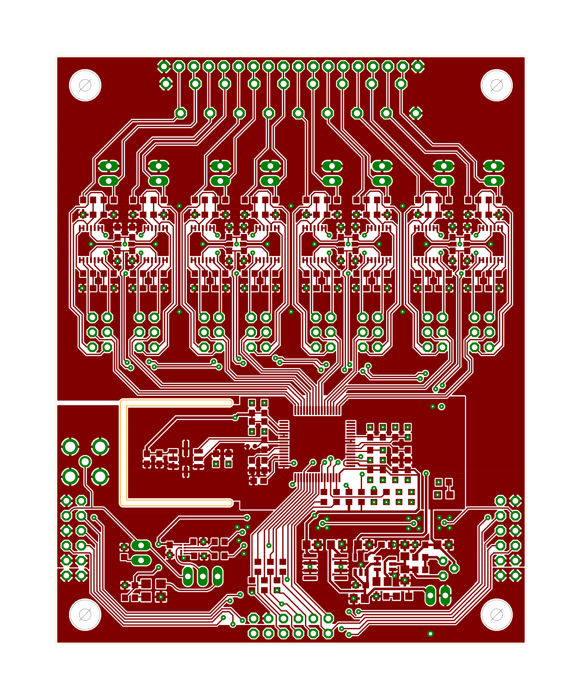

# ADS131E08 - Breakout
#### Features:
 - Daisy Chainable Design
 - External Clock Input
 - Configurble Active / Passive Frontend
 - Frontend Op-amps TLV4333 - 2uV Vos, 0.02 uV/C
 - Input Range -2.4V to 2.4V
 - Resolution 24 bit
 - Max sampling speeds 8ksps @ 24 bit, 32 ksps @ 16 bit
 
## Rendered Board

## Silkscreen and Component Layout

## Copper Layers
| Top Copper | Bottom Copper |
|:----:|:----:|
||  |