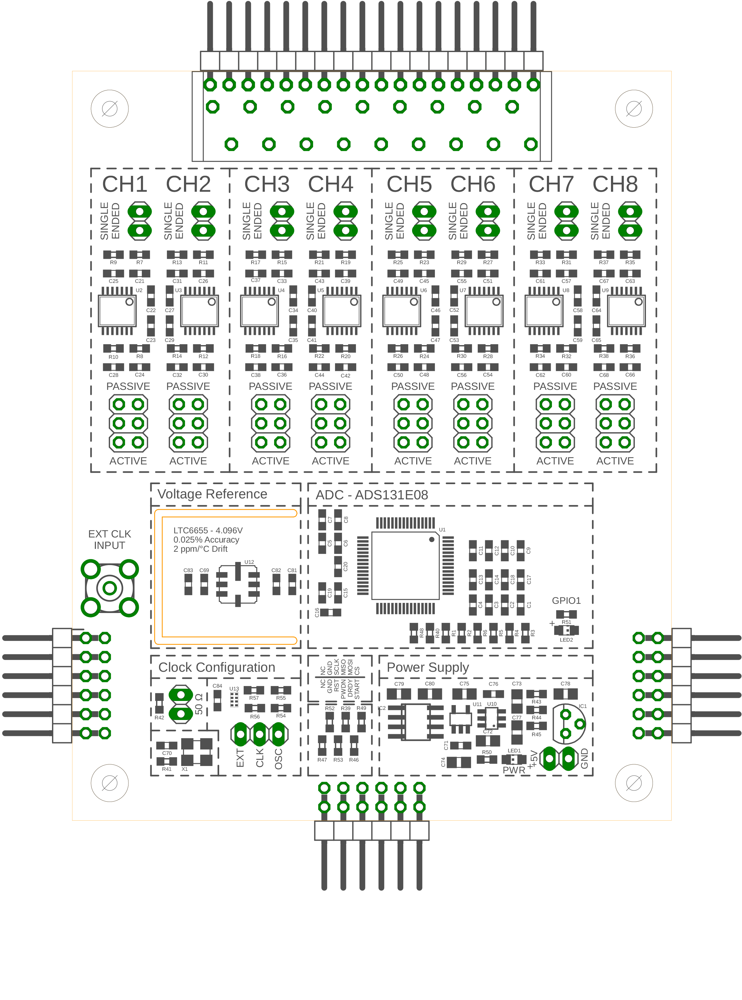
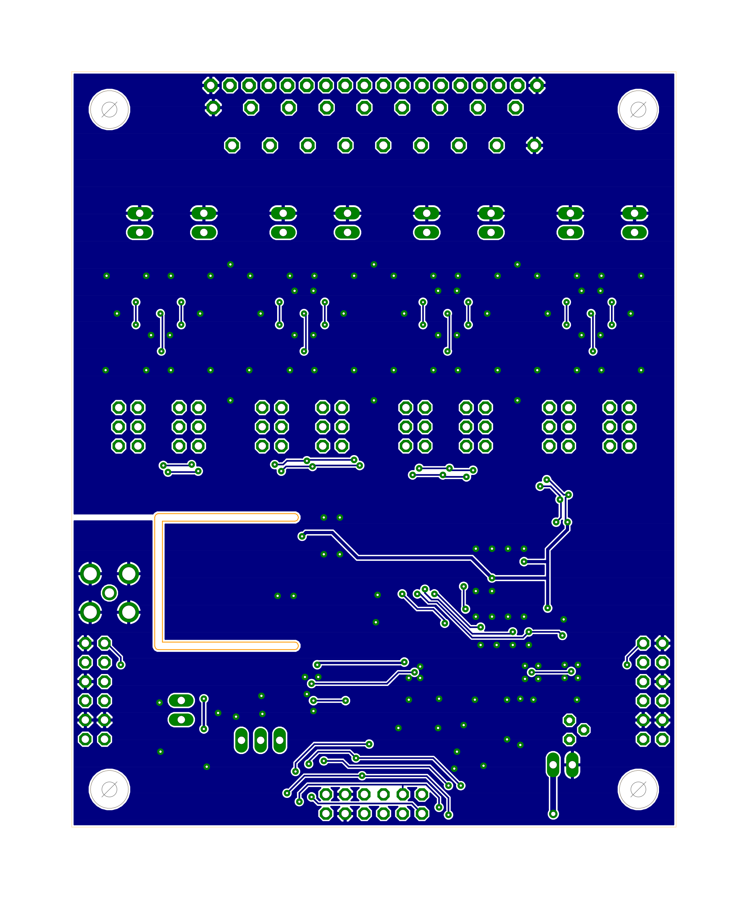

# ADS131E08 - Breakout
#### Features:
 - External Clock
 - Daisy Chainable Design
 - Active / Passive Frontend
 - Frontend Op-amps TLV4333 - 2µV offset 0.02 µV/C
 - Input Range -2.4V to 2.4V
 - Resolution 24 bit
 - Max sampling speeds 8ksps @ 24 bit 32 ksps @ 16 bit
 
## Rendered Board

## Layers
| Silkscreen | Top Copper | Bottom Copper |
|:----:|:----:|:----:|
|||  |